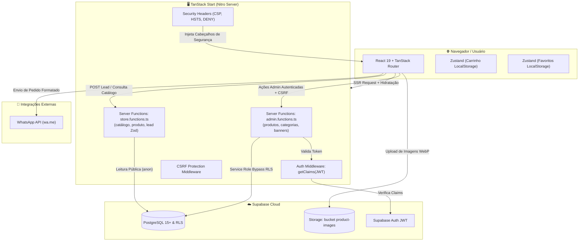

# Documentação Técnica do Sistema — Catálogo Metal Arts

> **Versão:** 2.0.0 (Pronto para Produção)  
> **Data:** Setembro de 2026  
> **Stack Principal:** TanStack Start (React 19 + TypeScript + Vite 8 + SSR), Supabase (PostgreSQL 15+, Auth JWT, Storage, RLS), Tailwind CSS v4, TanStack Router & Query v5.

---

## 📋 Sumário

1. [Visão Geral da Arquitetura](#1-visão-geral-da-arquitetura)
2. [Estrutura do Projeto e Organização de Arquivos](#2-estrutura-do-projeto-e-organização-de-arquivos)
3. [Modelo de Dados e Histórico de Migrações (Supabase PostgreSQL)](#3-modelo-de-dados-e-histórico-de-migrações-supabase-postgresql)
4. [Segurança, Autenticação e Row Level Security (RLS)](#4-segurança-autenticação-e-row-level-security-rls)
5. [Gerenciamento de Estado e Ciclo de Dados](#5-gerenciamento-de-estado-e-ciclo-de-dados)
6. [Pipeline de Processamento e Otimização de Mídia](#6-pipeline-de-processamento-e-otimização-de-mídia)
7. [Engenharia de Rotas, SSR e Server Functions](#7-engenharia-de-rotas-ssr-e-server-functions)
8. [Performance, Caching e Índices de Banco](#8-performance-caching-e-índices-de-banco)
9. [Guia de Configuração, Execução e Deploy](#9-guia-de-configuração-execução-e-deploy)

---

## 1. Visão Geral da Arquitetura

O sistema é um **Catálogo Digital e Gestor Comercial de Loja Única de Alta Performance**, desenvolvido para a **Metal Arts** com foco em móveis finos e peças sob medida em madeira nobre.

A arquitetura combina **Server-Side Rendering (SSR)** para indexação rápida e entrega de HTML pronto, com **Server Functions seguras** que isolam chaves de administração no servidor.



### Pilares de Engenharia:
- **SSR e Server Functions:** A renderização pública inicial é feita no servidor. Mutações administrativas operam como RPCs tipados (`createServerFn`) protegidos contra CSRF.
- **Isolamento de Segurança da Chave Mestra:** A `SUPABASE_SERVICE_ROLE_KEY` reside unicamente no servidor, sem qualquer exposição ao bundle do navegador.
- **Validação de Entrada com Zod:** Toda captura de dados de leads e formulários passa por sanitização rigorosa antes de persistir no banco de dados.
- **Processamento de Mídia Client-side:** Conversão para WebP de alta fidelidade no navegador antes do upload, eliminando o custo de processamento no servidor e acelerando o delivery.

---

## 2. Estrutura do Projeto e Organização de Arquivos

```text
catalogo-metal-arts-main/
├── docs/                        # Documentação técnica e de produto
│   ├── README.md                # Sumário da documentação
│   ├── DOCUMENTACAO_SISTEMA.md  # Este manual técnico
│   └── PRD_COMPLETO.md          # Documento de Requisitos de Produto (v2.0)
├── public/                      # Ativos estáticos e arquivos públicos
│   ├── logo-metal_arts.png      # Logotipo oficial
│   ├── img-footer.jpg           # Fundo institucional do rodapé
│   └── robots.txt               # Diretivas para buscadores (bloqueio de /admin e /auth)
├── supabase/
│   ├── config.toml              # Configurações do Supabase CLI
│   └── migrations/              # 15 migrações SQL cronológicas
├── src/
│   ├── components/
│   │   ├── admin/               # Telas e campos administrativos
│   │   │   ├── ImageField.tsx   # Upload de imagem com compressão WebP
│   │   │   └── GalleryField.tsx # Upload de galeria múltipla
│   │   ├── catalog/             # Componentes da experiência de compra
│   │   │   ├── HeroCarousel.tsx # Carrossel com suporte a mobile picture e fetchPriority
│   │   │   ├── PromoBannerGrid.tsx # Grid de 4 mini-banners promocionais
│   │   │   ├── MiddleHighlightBanner.tsx # Banner central panorâmico
│   │   │   ├── CraftEditorialSplit.tsx # Seção editorial e institucional artesanal
│   │   │   ├── WoodTypesShowcase.tsx # Vitrine interativa de madeiras nobres
│   │   │   ├── CatalogBanner.tsx # Banner do topo do catálogo
│   │   │   ├── ProductCard.tsx  # Card com aspect-square e lazy loading
│   │   │   ├── CartSheet.tsx    # Gaveta do carrinho e checkout WhatsApp
│   │   │   ├── CategoryBar.tsx  # Barra de atalhos rápidos de categoria
│   │   │   └── FavoriteButton.tsx # Botão de favoritar
│   │   ├── decor/               # Elementos decorativos (folhas, ramos botânicos)
│   │   ├── layout/              # Header, Footer, Topbar
│   │   └── ui/                  # Primitivos Shadcn/Radix (Button, Dialog, etc.)
│   ├── integrations/
│   │   └── supabase/
│   │       ├── client.ts        # Cliente público (anon)
│   │       ├── client.server.ts # Cliente backend (service_role)
│   │       ├── auth-middleware.ts # Validação de token JWT do admin
│   │       └── types.ts         # Tipos TypeScript 100% atualizados com o Postgres
│   ├── lib/
│   │   ├── admin.functions.ts   # Server Functions para CRUD administrativo seguro
│   │   ├── store.functions.ts   # Server Functions para dados do catálogo e leads (Zod)
│   │   ├── image.ts             # Pipeline de compressão WebP (4K, qualidade 0.92, cache 1 ano)
│   │   ├── cart.ts              # Store de carrinho (Zustand + localStorage)
│   │   ├── favorites.ts         # Store de favoritos (Zustand + localStorage)
│   │   ├── phone.ts             # Formatador e máscara de telefone brasileiro
│   │   ├── whatsapp.ts          # Construtor da mensagem de checkout para o WhatsApp
│   │   └── format.ts            # Utilitários de formatação de moeda
│   ├── routes/                  # Roteamento baseado em arquivos (TanStack Router)
│   │   ├── __root.tsx           # Shell raiz, HTML head, fontes e tema dinâmico
│   │   ├── index.tsx            # Página Inicial (Home)
│   │   ├── catalogo.tsx         # Catálogo completo com busca, filtros e paginação
│   │   ├── produto.$id.tsx      # Detalhes do produto com galeria e atributos de marcenaria
│   │   ├── favoritos.tsx        # Lista de itens favoritados
│   │   ├── auth.tsx             # Tela de login administrativo
│   │   └── _authenticated/      # Rotas administrativas restritas
│   │       ├── route.tsx        # Layout guard de autenticação
│   │       └── admin/
│   │           ├── index.tsx    # Dashboard com métricas
│   │           ├── produtos.tsx # Gestão de produtos
│   │           ├── categorias.tsx # Gestão de categorias
│   │           ├── banners.tsx  # Gestão multimodal de banners
│   │           ├── leads.tsx    # Gestão e exportação de contatos (CSV)
│   │           └── configuracoes.tsx # Identidade visual e dados da loja
│   ├── server.ts                # Servidor Nitro com cabeçalhos de segurança (CSP, HSTS)
│   └── start.ts                 # Configuração do TanStack Start com CSRF middleware
├── todas_migracoes.sql          # Script consolidado com todo o histórico SQL
└── package.json
```

---

## 3. Modelo de Dados e Histórico de Migrações (Supabase PostgreSQL)

O banco de dados relacional foi construído de forma incremental através de **15 migrações cronológicas**:

| Ordem | Arquivo de Migração | Descrição da Evolução |
|---|---|---|
| 01 | `20260801000000_initial_schema.sql` | Estrutura base de tabelas e trigger `update_updated_at_column` |
| 02 | `20260807140932_e1d2b06e-2edc-43ff-b0bd-9fd2eedb3c5c.sql` | Criação de tabelas com RLS inicial |
| 03 | `20260810135753_c401e3ef-553d-439f-a470-25680646a0ee.sql` | Adição da coluna `images text[]` em produtos (galeria múltipla) |
| 04 | `20260812211500_add_about_store.sql` | Adição dos campos `about_title`, `about_description`, `about_image_url` |
| 05 | `20260812214500_add_category_image.sql` | Adição de `image_url` na tabela `categories` |
| 06 | `20260817164100_add_product_images_bucket.sql` | Criação do bucket de storage `product-images` e policies públicas |
| 07 | `20260817164600_tighten_rls_policies.sql` | **Endurecimento de RLS:** remoção de escritas diretas do cliente |
| 08 | `20260817175000_add_max_installments.sql` | Adição de `max_installments` em `store_settings` (parcelamento) |
| 09 | `20260817180000_add_missing_store_settings_fields.sql` | Campos `announcement_text`, `catalog_banner_url`, `trust_badge_1..4` |
| 10 | `20260817181000_add_missing_products_fields.sql` | Campos `stock_quantity`, `sku`, `sizes text[]` |
| 11 | `20260818120000_add_colors_to_products.sql` | Campo `colors text[]` em `products` |
| 12 | `20260821000000_add_wood_furniture_fields.sql` | **Atributos de Marcenaria:** `wood_type`, `dimensions`, `finish`, `weight_kg` |
| 13 | `20260903150000_add_mobile_image_url_to_banners.sql` | Imagem mobile dedicada (`mobile_image_url`) na tabela `banners` |
| 14 | `20260904140000_add_services_and_editorial_fields.sql` | Campos JSONB e textuais de serviços, madeiras e diferenciais |
| 15 | `20260904160000_add_performance_indexes.sql` | **Índices de Performance:** `idx_products_active`, `idx_banners_active_sort`, etc. |

### Esquema Consolidado das Tabelas Principais:

```sql
-- 1. store_settings (Dados da Loja, Identidade e Editorial)
CREATE TABLE public.store_settings (
  id uuid PRIMARY KEY DEFAULT gen_random_uuid(),
  name text NOT NULL DEFAULT 'Metal Arts',
  logo_url text,
  primary_color text NOT NULL DEFAULT '#1B3B2B',
  whatsapp_number text NOT NULL DEFAULT '',
  instagram_url text,
  facebook_url text,
  address text,
  max_installments integer DEFAULT 12,
  announcement_text text,
  catalog_banner_url text,
  about_title text,
  about_subtitle text,
  about_badge_text text,
  about_description text,
  about_image_url text,
  about_differentials jsonb,
  services_header jsonb,
  services_items jsonb,
  services_woods jsonb,
  trust_badge_1 text,
  trust_badge_2 text,
  trust_badge_3 text,
  trust_badge_4 text,
  created_at timestamptz NOT NULL DEFAULT now(),
  updated_at timestamptz NOT NULL DEFAULT now()
);

-- 2. categories (Categorias de Móveis e Peças)
CREATE TABLE public.categories (
  id uuid PRIMARY KEY DEFAULT gen_random_uuid(),
  name text NOT NULL,
  image_url text,
  sort_order integer NOT NULL DEFAULT 0,
  created_at timestamptz NOT NULL DEFAULT now(),
  updated_at timestamptz NOT NULL DEFAULT now()
);

-- 3. banners (Banners Multimodais: Hero, Grid, Central, Catálogo)
CREATE TABLE public.banners (
  id uuid PRIMARY KEY DEFAULT gen_random_uuid(),
  title text NOT NULL DEFAULT '',
  subtitle text,
  cta_text text,
  cta_link text,
  image_url text,
  mobile_image_url text,
  sort_order integer NOT NULL DEFAULT 0, -- 0=Hero, 1..4=Grid, 5=Central, 6=Catálogo
  is_active boolean NOT NULL DEFAULT true,
  created_at timestamptz NOT NULL DEFAULT now(),
  updated_at timestamptz NOT NULL DEFAULT now()
);

-- 4. products (Peças de Marcenaria e Móveis)
CREATE TABLE public.products (
  id uuid PRIMARY KEY DEFAULT gen_random_uuid(),
  category_id uuid REFERENCES public.categories(id) ON DELETE SET NULL,
  name text NOT NULL,
  description text,
  price numeric(10,2) NOT NULL DEFAULT 0,
  promo_price numeric(10,2),
  image_url text,
  images text[] NOT NULL DEFAULT '{}'::text[],
  is_active boolean NOT NULL DEFAULT true,
  is_featured boolean NOT NULL DEFAULT false,
  sort_order integer NOT NULL DEFAULT 0,
  stock_quantity integer,
  sku text,
  sizes text[],
  colors text[],
  wood_type text,       -- Ex: Cumaru, Cedro Rosa, Peroba Rosa
  dimensions text,      -- Ex: 220cm x 100cm x 76cm
  finish text,          -- Ex: Verniz Fosco PU, Óleo Mineral
  weight_kg numeric(10,2),
  created_at timestamptz NOT NULL DEFAULT now(),
  updated_at timestamptz NOT NULL DEFAULT now()
);

-- 5. customer_leads (Captura de Contatos e Pedidos)
CREATE TABLE public.customer_leads (
  id uuid PRIMARY KEY DEFAULT gen_random_uuid(),
  name text,
  phone text,
  email text,
  product_interest uuid REFERENCES public.products(id) ON DELETE SET NULL,
  source text NOT NULL DEFAULT 'order', -- 'order' ou 'newsletter'
  created_at timestamptz NOT NULL DEFAULT now()
);
```

---

## 4. Segurança, Autenticação e Row Level Security (RLS)

O sistema implementa uma defesa em camadas:

1. **Separação Estrita de Clientes Supabase:**
   - **`publicClient()` (`client.ts`):** Utiliza apenas a chave anônima pública (`VITE_SUPABASE_PUBLISHABLE_KEY`). Aplicado apenas para consultas de leitura públicas protegidas por RLS.
   - **`supabaseAdmin` (`client.server.ts`):** Utiliza a `SUPABASE_SERVICE_ROLE_KEY`. Existe **apenas no lado do servidor** e executa dentro de Server Functions (`admin.functions.ts`).
2. **Proteção de Rotas com `requireSupabaseAuth`:**
   - Todas as Server Functions do painel administrativo passam pela validação do token JWT do usuário via `supabase.auth.getClaims(jwt)`. Se inválido ou expirado, a execução é interrompida com `HTTP 401 Unauthorized`.
3. **Proteção Anti-CSRF:**
   - O TanStack Start foi configurado com `createCsrfMiddleware()` no arquivo `src/start.ts`, validando os headers das requisições mutativas contra ataques Cross-Site Request Forgery.
4. **Security Headers Avançados (`src/server.ts`):**
   - **CSP (Content-Security-Policy):** Restringe carregamento de scripts, iframes e conexões exclusivamente aos domínios autorizados (Supabase, Google Fonts, etc.).
   - **HSTS:** `max-age=31536000; includeSubDomains` força HTTPS em navegadores modernos.
   - **X-Frame-Options: DENY:** Impede que o catálogo seja incorporado em iframes maliciosos (anti-clickjacking).
   - **Permissions-Policy:** Desativa acesso a câmera, microfone e geolocalização.
5. **Validação Zod nos Leads (`recordLead`):**
   - E-mails têm formato e tamanho checados.
   - Telefones são sanitizados.
   - O campo `source` é estritamente limitado ao enum `["order", "newsletter"]`, evitando injeções de conteúdo arbitrário.

---

## 5. Gerenciamento de Estado e Ciclo de Dados

- **TanStack React Query v5:**
  - `staleTime: 1000 * 60 * 5` (5 minutos) para dados de catálogo, evitando requisições redundantes.
  - Invalidação cirúrgica de cache pós-mutação: ao salvar produto, categoria ou banner no admin, as queries `['catalog']` e `['admin', ...]` são invalidadas simultaneamente.
- **Zustand com Persistência Local:**
  - **Carrinho (`cart.ts`):** Mantido no `localStorage` do dispositivo. Suporta atualização reativa de quantidade, remoção, cálculo de subtotal e limpeza pós-pedido.
  - **Favoritos (`favorites.ts`):** Permite curtir peças sem obrigar login. O estado é recuperado instantaneamente ao abrir a página `/favoritos`.
- **Tema Dinâmico via CSS Variables:**
  - O componente `__root.tsx` lê a cor primária de `store_settings` no carregamento e a injeta como variáveis CSS (`--primary`, `--ring`), personalizando a identidade visual do catálogo em tempo real sem rebuild.

---

## 6. Pipeline de Processamento e Otimização de Mídia

O arquivo `src/lib/image.ts` encapsula a lógica de compressão de imagem:

1. **Formato WebP de Alta Fidelidade:** Todas as imagens são convertidas via Canvas para `image/webp` com qualidade `0.92`.
2. **Suporte a Resoluções 4K:** Banners panorâmicos suportam até `3840px` no lado maior, com interpolação bicúbica suave (`imageSmoothingQuality = "high"`), preservando veios e texturas de madeira nobre.
3. **Controle de Peso:** Limite de segurança de até `6MB` pós-compressão.
4. **Cache Imutável:** Headers HTTP configurados como:
   ```http
   Cache-Control: 31536000, immutable
   ```
   Garante que uma vez que o cliente baixe a imagem, o navegador nunca precisará revalidá-la.
5. **Estratégia LCP no Frontend:**
   - O primeiro slide do carrossel utiliza `loading="eager"`, `fetchPriority="high"` e `<picture>` com breakpoint mobile dedicado para garantir nota máxima em Core Web Vitals.
   - Imagens dos produtos utilizam `loading="lazy"` e `decoding="async"`, com proporções travadas em `aspect-square` para eliminar saltos de layout (CLS zero).

---

## 7. Engenharia de Rotas, SSR e Server Functions

O projeto utiliza o **TanStack Router** estruturado em rotas baseadas em arquivo:

- **`/` (`src/routes/index.tsx`):** Landing page com SSR que consome `getStoreData()`. Pré-renderiza banners, categorias e produtos em destaque.
- **`/catalogo` (`src/routes/catalogo.tsx`):** Catálogo geral com busca, filtros de categoria e paginação sincronizada na URL.
- **`/produto/$id` (`src/routes/produto.$id.tsx`):** Detalhe da peça com meta tags dinâmicas de OpenGraph (imagem, título e preço para compartilhamento no WhatsApp).
- **`/favoritos` (`src/routes/favoritos.tsx`):** Listagem de produtos favoritados recuperados do `localStorage`.
- **`/auth` (`src/routes/auth.tsx`):** Login de administrador com `noindex` no HTML.
- **`/_authenticated/admin/*`:** Rotas privadas protegidas pelo layout guard `route.tsx`.

---

## 8. Performance, Caching e Índices de Banco

A migração `20260904160000_add_performance_indexes.sql` adicionou 4 índices parciais no banco de dados para garantir respostas sub-milissegundo em catálogos volumosos:

```sql
-- Índices parciais (otimizam leituras sem inflar o tamanho do índice)
CREATE INDEX IF NOT EXISTS idx_products_active ON public.products(is_active) WHERE is_active = true;
CREATE INDEX IF NOT EXISTS idx_products_featured ON public.products(is_featured) WHERE is_featured = true;
CREATE INDEX IF NOT EXISTS idx_banners_active_sort ON public.banners(is_active, sort_order) WHERE is_active = true;
CREATE INDEX IF NOT EXISTS idx_categories_sort ON public.categories(sort_order);
```

---

## 9. Guia de Configuração, Execução e Deploy

### Variáveis de Ambiente Necessárias (`.env`)

```env
# Cliente (Navegador)
VITE_SUPABASE_URL="https://seu-projeto.supabase.co"
VITE_SUPABASE_PUBLISHABLE_KEY="eyJhbGciOiJIUzI1NiIsIn..."

# Servidor (SSR & Server Functions)
SUPABASE_URL="https://seu-projeto.supabase.co"
SUPABASE_PUBLISHABLE_KEY="eyJhbGciOiJIUzI1NiIsIn..."
SUPABASE_SERVICE_ROLE_KEY="eyJhbGciOiJIUzI1NiIsIn..."
```

### Comandos de Terminal

```bash
# Instalação de dependências
npm install

# Execução local em desenvolvimento
npm run dev

# Checagem estrita de tipos
npx tsc --noEmit

# Compilação para produção
npm run build

# Pré-visualização do bundle compilado
npm run preview
```

### Checklist Final Pré-Deploy:
1. Executar `todas_migracoes.sql` no SQL Editor do Supabase.
2. Certificar-se de que o bucket `product-images` está criado e marcado como **Público**.
3. No painel do Supabase, em *Authentication* → *Sign In / Up*, desmarcar a opção **"Enable Sign Up"** para impedir cadastros públicos de terceiros.
4. Definir as variáveis de ambiente no serviço de hospedagem (Vercel, Cloudflare, Coolify ou VPS Node.js).
