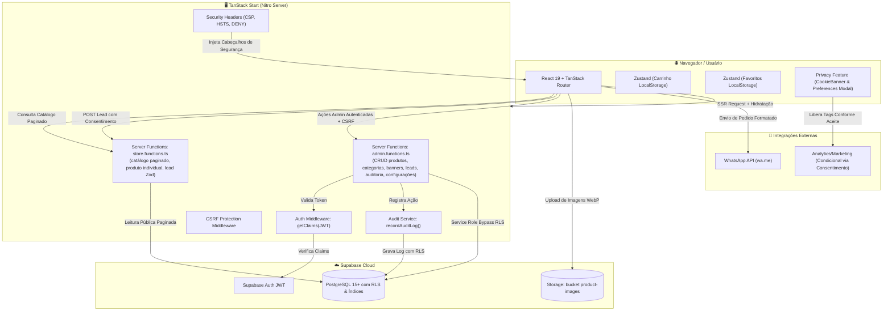

# Documentação Técnica do Sistema — Catálogo Metal Arts

> **Versão:** 2.1.0 (Pronto para Produção — Performance, LGPD & Governança)  
> **Data:** Setembro de 2026  
> **Stack Principal:** TanStack Start (React 19 + TypeScript + Vite 8 + Nitro SSR), Supabase (PostgreSQL 15+, Auth JWT, Storage, RLS), Tailwind CSS v4, TanStack Router & Query v5.

---

## 📋 Sumário

1. [Visão Geral da Arquitetura](#1-visão-geral-da-arquitetura)
2. [Estrutura do Projeto e Organização de Arquivos](#2-estrutura-do-projeto-e-organização-de-arquivos)
3. [Modelo de Dados e Histórico de Migrações (Supabase PostgreSQL)](#3-modelo-de-dados-e-histórico-de-migrações-supabase-postgresql)
4. [Segurança, Autenticação, Auditoria e Row Level Security (RLS)](#4-segurança-autenticação-auditoria-e-row-level-security-rls)
5. [Gerenciamento de Estado e Ciclo de Dados](#5-gerenciamento-de-estado-e-ciclo-de-dados)
6. [Pipeline de Processamento, Imagens Responsivas e Mídia](#6-pipeline-de-processamento-imagens-responsivas-e-mídia)
7. [Engenharia de Rotas, SSR e Server Functions](#7-engenharia-de-rotas-ssr-e-server-functions)
8. [Performance, Caching e Índices de Banco](#8-performance-caching-e-índices-de-banco)
9. [Governança, LGPD e Gestão de Cookies](#9-governança-lgpd-e-gestão-de-cookies)
10. [Identidade da Loja e CNPJ da Empresa](#10-identidade-da-loja-e-cnpj-da-empresa)
11. [Guia de Configuração, Execução e Deploy](#11-guia-de-configuração-execução-e-deploy)

---

## 1. Visão Geral da Arquitetura

O sistema é um **Catálogo Digital e Gestor Comercial de Alta Performance**, desenvolvido para a **Metal Arts** com foco em móveis finos e peças sob medida em madeira nobre.

A arquitetura combina **Server-Side Rendering (SSR)** para indexação rápida e entrega de HTML pronto, com **Server Functions seguras** que isolam chaves de administração no servidor, motor de busca e paginação no PostgreSQL, além de esteira integral de conformidade com a LGPD (Lei 13.709/2018).



### Pilares de Engenharia:

- **SSR e Server Functions:** A renderização pública inicial é feita no servidor. Mutações administrativas operam como RPCs tipados (`createServerFn`) protegidos contra CSRF.
- **Isolamento de Segurança da Chave Mestra:** A `SUPABASE_SERVICE_ROLE_KEY` reside unicamente no servidor, sem qualquer exposição ao bundle do navegador.
- **Busca e Paginação Real no Banco:** Consultas do catálogo utilizam `range(from, to)` com `count: "exact"` no PostgreSQL, prevenindo o download massivo de produtos no cliente.
- **Validação de Entrada com Zod:** Toda captura de dados de leads e formulários passa por sanitização rigorosa antes de persistir no banco de dados.
- **Conformidade LGPD Nativa:** Consentimento de cookies granular com controle de versão, canal oficial de atendimento a titulares e trilhas de auditoria para ações administrativas sensíveis.
- **Processamento de Mídia em Dupla Camada:** Compressão WebP client-side antes do upload + transformação dinâmica de tamanhos via Supabase Image Transformations e `srcset` responsivo.

---

## 2. Estrutura do Projeto e Organização de Arquivos

```text
catalogo-metal-arts-main/
├── docs/                        # Documentação técnica, produto e governança
│   ├── README.md                # Sumário da documentação
│   ├── DOCUMENTACAO_SISTEMA.md  # Este manual técnico
│   ├── PRD_COMPLETO.md          # Documento de Requisitos de Produto (v2.1)
│   ├── lgpd-mapa-de-dados.md    # Mapeamento completo de dados e bases legais (LGPD)
│   └── politica-retencao-dados.md # Política de retenção e expurgo de leads/logs
├── public/                      # Ativos estáticos e arquivos públicos
│   ├── logo-metal_arts.png      # Logotipo oficial
│   ├── img-footer.jpg           # Fundo institucional do rodapé
│   ├── robots.txt               # Diretivas para buscadores
│   └── sitemap.xml              # Mapa do site indexável com rotas institucionais
├── supabase/
│   ├── config.toml              # Configurações do Supabase CLI
│   └── migrations/              # 16 migrações SQL cronológicas
├── src/
│   ├── components/
│   │   ├── admin/               # Telas e campos administrativos
│   │   │   ├── ImageField.tsx   # Upload de imagem com compressão WebP
│   │   │   └── GalleryField.tsx # Upload de galeria múltipla
│   │   ├── catalog/             # Componentes da experiência de compra
│   │   │   ├── HeroCarousel.tsx # Carrossel com mobile picture e fetchPriority
│   │   │   ├── PromoBannerGrid.tsx # Grid de 4 mini-banners promocionais
│   │   │   ├── MiddleHighlightBanner.tsx # Banner central panorâmico
│   │   │   ├── CraftEditorialSplit.tsx # Seção editorial e institucional artesanal
│   │   │   ├── WoodTypesShowcase.tsx # Vitrine interativa de madeiras nobres
│   │   │   ├── CatalogBanner.tsx # Banner do topo do catálogo
│   │   │   ├── ProductCard.tsx  # Card memoizado com srcset e lazy loading
│   │   │   ├── CartSheet.tsx    # Gaveta do carrinho e checkout WhatsApp com consentimento LGPD
│   │   │   ├── CategoryBar.tsx  # Barra de atalhos rápidos de categoria
│   │   │   └── FavoriteButton.tsx # Botão de favoritar
│   │   ├── decor/               # Elementos decorativos artesanais
│   │   ├── layout/              # Header, Footer (com CNPJ e links LGPD), Topbar
│   │   └── ui/                  # Primitivos Shadcn/Radix (Button, Dialog, etc.)
│   ├── features/
│   │   └── privacy/             # Módulo de Governança & Cookie Consent
│   │       ├── types/           # Tipos de consentimento (necessários, analíticos, marketing)
│   │       ├── services/        # Serviço de leitura e persistência versionada em localStorage
│   │       ├── hooks/           # Hook reativo useConsent()
│   │       └── components/      # CookieBanner e CookiePreferencesModal
│   ├── integrations/
│   │   └── supabase/
│   │       ├── client.ts        # Cliente público (anon)
│   │       ├── client.server.ts # Cliente backend (service_role)
│   │       ├── auth-middleware.ts # Validação de token JWT do admin
│   │       └── types.ts         # Tipos TypeScript 100% atualizados com o Postgres
│   ├── lib/
│   │   ├── admin.functions.ts   # Server Functions para CRUD, exportação CSV e auditoria
│   │   ├── store.functions.ts   # Server Functions para catálogo paginado, produto por id e leads (Zod)
│   │   ├── queries.ts           # Query options granulares com staleTime e gcTime
│   │   ├── image.ts             # Pipeline WebP, getOptimizedImageUrl e getProductSrcSet
│   │   ├── analytics.ts         # Módulo de telemetria condicional ao consentimento
│   │   ├── marketing.ts         # Módulo de marketing condicional ao consentimento
│   │   ├── cart.ts              # Store de carrinho (Zustand + localStorage)
│   │   ├── favorites.ts         # Store de favoritos (Zustand + localStorage)
│   │   ├── phone.ts             # Formatador e máscara de telefone brasileiro
│   │   └── whatsapp.ts          # Construtor da mensagem de checkout para o WhatsApp
│   ├── routes/                  # Roteamento baseado em arquivos (TanStack Router)
│   │   ├── __root.tsx           # Shell raiz, HTML head, tema dinâmico e CookieBanner
│   │   ├── index.tsx            # Página Inicial (Home)
│   │   ├── catalogo.tsx         # Catálogo paginado no banco com filtros e busca
│   │   ├── produto.$id.tsx      # Detalhes carregados sob demanda por ID (loader otimizado)
│   │   ├── favoritos.tsx        # Lista de itens favoritados
│   │   ├── privacidade.tsx      # Política de Privacidade oficial (LGPD)
│   │   ├── cookies.tsx          # Política de Cookies com reabertura de preferências
│   │   ├── direitos-titular.tsx # Formulário de exercício de direitos (Art. 18 LGPD)
│   │   ├── auth.tsx             # Tela de login administrativo
│   │   └── _authenticated/      # Rotas administrativas restritas
│   │       ├── route.tsx        # Layout guard de autenticação e menu lateral
│   │       └── admin/
│   │           ├── index.tsx    # Dashboard com métricas
│   │           ├── produtos.tsx # Gestão de produtos
│   │           ├── categorias.tsx # Gestão de categorias
│   │           ├── banners.tsx  # Gestão multimodal de banners
│   │           ├── leads.tsx    # Gestão, consentimento e exportação segura (CSV)
│   │           ├── auditoria.tsx # Painel de visualização de logs de auditoria
│   │           └── configuracoes.tsx # Identidade da loja (Nome, CNPJ, Cores, Redes)
│   ├── server.ts                # Servidor Nitro com cabeçalhos de segurança (CSP, HSTS)
│   └── start.ts                 # Configuração do TanStack Start com CSRF middleware
├── todas_migracoes.sql          # Script consolidado com todo o histórico SQL
└── package.json
```

---

## 3. Modelo de Dados e Histórico de Migrações (Supabase PostgreSQL)

O banco de dados relacional foi construído de forma incremental através de **16 migrações cronológicas**:

| Ordem | Arquivo de Migração                                       | Descrição da Evolução                                                                                                                                                  |
| ----- | --------------------------------------------------------- | ---------------------------------------------------------------------------------------------------------------------------------------------------------------------- |
| 01    | `20260801000000_initial_schema.sql`                       | Estrutura base de tabelas e trigger `update_updated_at_column`                                                                                                         |
| 02    | `20260807140932_e1d2b06e-2edc-43ff-b0bd-9fd2eedb3c5c.sql` | Criação de tabelas com RLS inicial                                                                                                                                     |
| 03    | `20260810135753_c401e3ef-553d-439f-a470-25680646a0ee.sql` | Adição da coluna `images text[]` em produtos (galeria múltipla)                                                                                                        |
| 04    | `20260812211500_add_about_store.sql`                      | Adição dos campos `about_title`, `about_description`, `about_image_url`                                                                                                |
| 05    | `20260812214500_add_category_image.sql`                   | Adição de `image_url` na tabela `categories`                                                                                                                           |
| 06    | `20260817164100_add_product_images_bucket.sql`            | Criação do bucket de storage `product-images` e policies públicas                                                                                                      |
| 07    | `20260817164600_tighten_rls_policies.sql`                 | **Endurecimento de RLS:** remoção de escritas diretas do cliente                                                                                                       |
| 08    | `20260817175000_add_max_installments.sql`                 | Adição de `max_installments` em `store_settings` (parcelamento)                                                                                                        |
| 09    | `20260817180000_add_missing_store_settings_fields.sql`    | Campos `announcement_text`, `catalog_banner_url`, `trust_badge_1..4`                                                                                                   |
| 10    | `20260817181000_add_missing_products_fields.sql`          | Campos `stock_quantity`, `sku`, `sizes text[]`                                                                                                                         |
| 11    | `20260818120000_add_colors_to_products.sql`               | Campo `colors text[]` em `products`                                                                                                                                    |
| 12    | `20260821000000_add_wood_furniture_fields.sql`            | **Atributos de Marcenaria:** `wood_type`, `dimensions`, `finish`, `weight_kg`                                                                                          |
| 13    | `20260903150000_add_mobile_image_url_to_banners.sql`      | Imagem mobile dedicada (`mobile_image_url`) na tabela `banners`                                                                                                        |
| 14    | `20260904140000_add_services_and_editorial_fields.sql`    | Campos JSONB e textuais de serviços, madeiras e diferenciais                                                                                                           |
| 15    | `20260904160000_add_performance_indexes.sql`              | **Índices de Performance:** `idx_products_active`, `idx_banners_active_sort`, etc.                                                                                     |
| 16    | `20260908170000_add_performance_and_lgpd_audit.sql`       | **Performance, LGPD & Auditoria:** Índices compostos de catálogo, campos de consentimento em `customer_leads`, tabela `audit_logs` e campo `cnpj` em `store_settings`. |

### Esquema Consolidado das Tabelas Principais:

```sql
-- 1. store_settings (Dados da Loja, Identidade, CNPJ e Editorial)
CREATE TABLE public.store_settings (
  id uuid PRIMARY KEY DEFAULT gen_random_uuid(),
  name text NOT NULL DEFAULT 'Metal Arts',
  cnpj text, -- CNPJ da empresa (opcional, para conformidade fiscal e exibição no rodapé)
  logo_url text,
  primary_color text NOT NULL DEFAULT '#1B3B2B',
  whatsapp_number text NOT NULL DEFAULT '',
  instagram_url text,
  facebook_url text,
  address text,
  max_installments integer DEFAULT 12,
  announcement_text text,
  catalog_banner_url text,
  about_title text,
  about_subtitle text,
  about_badge_text text,
  about_description text,
  about_image_url text,
  about_differentials jsonb,
  services_header jsonb,
  services_items jsonb,
  services_woods jsonb,
  trust_badge_1 text,
  trust_badge_2 text,
  trust_badge_3 text,
  trust_badge_4 text,
  created_at timestamptz NOT NULL DEFAULT now(),
  updated_at timestamptz NOT NULL DEFAULT now()
);

-- 2. categories (Categorias de Móveis e Peças)
CREATE TABLE public.categories (
  id uuid PRIMARY KEY DEFAULT gen_random_uuid(),
  name text NOT NULL,
  image_url text,
  sort_order integer NOT NULL DEFAULT 0,
  created_at timestamptz NOT NULL DEFAULT now(),
  updated_at timestamptz NOT NULL DEFAULT now()
);

-- 3. banners (Banners Multimodais: Hero, Grid, Central, Catálogo)
CREATE TABLE public.banners (
  id uuid PRIMARY KEY DEFAULT gen_random_uuid(),
  title text NOT NULL DEFAULT '',
  subtitle text,
  cta_text text,
  cta_link text,
  image_url text,
  mobile_image_url text,
  sort_order integer NOT NULL DEFAULT 0,
  is_active boolean NOT NULL DEFAULT true,
  created_at timestamptz NOT NULL DEFAULT now(),
  updated_at timestamptz NOT NULL DEFAULT now()
);

-- 4. products (Peças de Marcenaria e Móveis)
CREATE TABLE public.products (
  id uuid PRIMARY KEY DEFAULT gen_random_uuid(),
  category_id uuid REFERENCES public.categories(id) ON DELETE SET NULL,
  name text NOT NULL,
  description text,
  price numeric(10,2) NOT NULL DEFAULT 0,
  promo_price numeric(10,2),
  image_url text,
  images text[] NOT NULL DEFAULT '{}'::text[],
  is_active boolean NOT NULL DEFAULT true,
  is_featured boolean NOT NULL DEFAULT false,
  sort_order integer NOT NULL DEFAULT 0,
  stock_quantity integer,
  sku text,
  sizes text[],
  colors text[],
  wood_type text,
  dimensions text,
  finish text,
  weight_kg numeric(10,2),
  created_at timestamptz NOT NULL DEFAULT now(),
  updated_at timestamptz NOT NULL DEFAULT now()
);

-- 5. customer_leads (Captura de Leads com Conformidade LGPD)
CREATE TABLE public.customer_leads (
  id uuid PRIMARY KEY DEFAULT gen_random_uuid(),
  name text,
  phone text,
  email text,
  product_interest uuid REFERENCES public.products(id) ON DELETE SET NULL,
  source text NOT NULL DEFAULT 'order', -- 'order' ou 'newsletter'
  marketing_consent boolean NOT NULL DEFAULT false, -- Opt-in explícito e voluntário
  consent_at timestamptz, -- Carimbo de data/hora da concessão
  privacy_version text DEFAULT 'v1.0', -- Versão dos termos aceitos
  created_at timestamptz NOT NULL DEFAULT now()
);

-- 6. audit_logs (Trilha Forense de Auditoria Administrativa)
CREATE TABLE public.audit_logs (
  id uuid PRIMARY KEY DEFAULT gen_random_uuid(),
  admin_id uuid REFERENCES auth.users(id) ON DELETE SET NULL,
  admin_email text,
  action text NOT NULL, -- Ex: 'UPDATE_SETTINGS', 'EXPORT_LEADS', 'CREATE_PRODUCT'
  resource text NOT NULL, -- Ex: 'settings', 'leads', 'products'
  resource_id text,
  details jsonb DEFAULT '{}'::jsonb,
  ip_address text,
  created_at timestamptz NOT NULL DEFAULT now()
);
```

---

## 4. Segurança, Autenticação, Auditoria e Row Level Security (RLS)

O sistema implementa defesa em camadas para atender às boas práticas e aos princípios de segurança e confidencialidade da LGPD:

1. **Separação Estrita de Clientes Supabase:**
   - **`publicClient()` (`client.ts`):** Utiliza unicamente a chave anônima pública (`VITE_SUPABASE_PUBLISHABLE_KEY`). Não tem permissão de escrita em tabelas administrativas.
   - **`supabaseAdmin` (`client.server.ts`):** Utiliza a `SUPABASE_SERVICE_ROLE_KEY`. Existe **apenas no lado do servidor** e é executada exclusivamente dentro de Server Functions (`admin.functions.ts`).
2. **Proteção de Rotas com `requireSupabaseAuth`:**
   - Todas as Server Functions do painel administrativo passam pela validação do token JWT do usuário via `supabase.auth.getClaims(jwt)`.
3. **Trilha de Auditoria Obrigatória (`audit_logs`):**
   - Toda alteração crítica de configurações da loja, criação/edição/remoção de produtos, exportação de contatos para CSV e expurgo de dados é rastreada na tabela `audit_logs` via `recordAuditLog()`.
4. **Sanitização de Fórmulas em Exportação CSV:**
   - Para evitar ataques de _CSV Injection_ (execução de comandos maliciosos no Excel via fórmulas iniciadas por `=`, `+`, `-`, `@`), a exportação em `exportAdminLeadsCsv` encapsula cada campo em aspas sanitizadas com encoding UTF-8 BOM (`\uFEFF`).
5. **Proteção Anti-CSRF e Headers HTTP Rigorosos:**
   - TanStack Start configurado com `createCsrfMiddleware()` no arquivo `src/start.ts`.
   - Headers configurados no servidor Nitro: `Content-Security-Policy`, `HSTS`, `X-Frame-Options: DENY`, `X-Content-Type-Options: nosniff` e `Permissions-Policy`.

---

## 5. Gerenciamento de Estado e Ciclo de Dados

- **TanStack React Query v5 Granular:**
  - `productsCatalogQueryOptions`: Gerencia a listagem paginada por página e categoria com `staleTime: 60s` e `gcTime: 5min`.
  - `productDetailQueryOptions`: Carrega individualmente a peça sob demanda com `staleTime: 2min`.
- **Zustand com Persistência Local:**
  - **Carrinho (`cart.ts`):** Mantido no `localStorage`. Suporta atualização reativa de quantidade, subtotal e limpeza pós-pedido.
  - **Favoritos (`favorites.ts`):** Permite curtir peças sem obrigar login.
- **Tema Dinâmico via CSS Variables:**
  - O componente `StoreTheme` lê a cor primária de `store_settings` e a injeta como variáveis CSS (`--primary`, `--ring`), refletindo alterações do lojista instantaneamente sem rebuild.

---

## 6. Pipeline de Processamento, Imagens Responsivas e Mídia

1. **Compressão Client-side em Alta Fidelidade:** No momento do upload pelo lojista, as imagens são comprimidas em WebP (qualidade balanceada de 85% para fotos e 92% para capas de alta definição), com redimensionamento inteligente via Canvas.
2. **Transformação Dinâmica com Supabase Storage:** A função `getOptimizedImageUrl` gera URLs com query parameters otimizados (`width`, `quality=85`, `format=origin`), servindo a dimensão ideal para cada breakpoint.
3. **Geração de `srcset` e `sizes` no `ProductCard`:**
   ```tsx
   
   ```
4. **Priorização da Dobra (LCP):** Os primeiros 4 cards do catálogo recebem `priority={true}`, ativando carregamento `eager` com prioridade de rede, eliminando atrasos no carregamento inicial.

---

## 7. Engenharia de Rotas, SSR e Server Functions

O roteamento baseado em arquivos do TanStack Router organiza a aplicação em áreas públicas e restritas:

- **`/` (`src/routes/index.tsx`):** Landing page com SSR rápido, banners institucionais e peças em destaque.
- **`/catalogo` (`src/routes/catalogo.tsx`):** Catálogo geral alimentado por paginação real no banco de dados (`getProductsCatalog`).
- **`/produto/$id` (`src/routes/produto.$id.tsx`):** Detalhe da peça com meta tags dinâmicas de OpenGraph, carregando **exclusivamente o produto requisitado** via `getProductById`.
- **`/favoritos` (`src/routes/favoritos.tsx`):** Listagem de produtos favoritados recuperados do `localStorage`.
- **`/privacidade` (`src/routes/privacidade.tsx`):** Política de Privacidade oficial adaptada à operação da marcenaria e canal de WhatsApp.
- **`/cookies` (`src/routes/cookies.tsx`):** Política informativa de cookies com tabela completa de categorias e botão interativo para reabrir o modal de preferências.
- **`/direitos-titular` (`src/routes/direitos-titular.tsx`):** Canal oficial para requisições de titulares (Art. 18 LGPD) com geração de protocolo formal de atendimento (`MA-YYYYMMDD-XXXX`).
- **`/_authenticated/admin/*`:**
  - `produtos.tsx`: CRUD completo de móveis e peças.
  - `categorias.tsx`: Ordenação e gestão de categorias.
  - `banners.tsx`: Banners Hero, Grid, Central e Catálogo.
  - `leads.tsx`: Listagem de contatos com badge de consentimento de marketing e botão de exportação segura para CSV.
  - `auditoria.tsx`: Painel com histórico forense de ações administrativas.
  - `configuracoes.tsx`: Identidade da Loja, CNPJ da Empresa, WhatsApp, cores e editorial.

---

## 8. Performance, Caching e Índices de Banco

Para eliminar a lentidão acima de 40 produtos, foram implementados:

1. **Paginação Real no PostgreSQL via `range(from, to)`:**
   A consulta não carrega centenas de registros na memória do Node/navegador. Ela extrai apenas a fatia correspondente à página requisitada (ex: 24 itens por vez) e a contagem total exata para controle dos botões de navegação.
2. **Seleção Cirúrgica de Colunas:**
   Na listagem de produtos, a coluna `description` (que pode conter longos textos explicativos) é omitida, reduzindo drasticamente o payload HTTP transferido na rede.
3. **Índices Compostos e Parciais (`20260908170000`):**
   ```sql
   -- Otimiza listagem geral de produtos ativos com ordenação
   CREATE INDEX IF NOT EXISTS idx_products_active_sort_created
   ON public.products (sort_order ASC, created_at DESC)
   WHERE is_active = true;

   -- Otimiza filtro por categoria com ordenação
   CREATE INDEX IF NOT EXISTS idx_products_active_category_sort
   ON public.products (category_id, sort_order ASC, created_at DESC)
   WHERE is_active = true;

   -- Otimiza busca textual sem case sensitivity
   CREATE INDEX IF NOT EXISTS idx_products_name_lower
   ON public.products (lower(name));
   ```

---

## 9. Governança, LGPD e Gestão de Cookies

A plataforma adere integralmente aos princípios da Lei Geral de Proteção de Dados Pessoais (Lei nº 13.709/2018):

1. **Módulo de Consentimento de Cookies (`src/features/privacy/`):**
   - **`CookieBanner`:** Banner não invasivo exibido no rodapé na primeira visita, informando a utilização de cookies essenciais e oferecendo opções claras de escolha.
   - **`CookiePreferencesModal`:** Modal com controle granular dividido em 3 categorias:
     - **Necessários:** Sempre ativos (sessão, carrinho de compras e segurança).
     - **Analíticos:** Desativados por padrão; só ativam telemetria caso o usuário autorize explicitamente.
     - **Marketing:** Desativados por padrão; controlam pixels e remarketing.
   - **Versionamento de Termos:** O aceite armazena a versão (`1.0.0`) e timestamp no `localStorage`. Alterações futuras nos termos reabrem o banner para renovação do consentimento.
2. **Consentimento Explícito para Marketing em Pedidos:**
   - No checkout (`CartSheet.tsx`), a opção _"Desejo receber novidades, coleções e ofertas exclusivas no meu WhatsApp/E-mail"_ é apresentada de forma **opcional e desmarcada por padrão**, sendo vedado o opt-out forçado.
   - O consentimento é persistido em `customer_leads` com data/hora e versão dos termos.
3. **Canal de Atendimento ao Titular (`/direitos-titular`):**
   - Formulário oficial para solicitações de confirmação de tratamento, acesso, correção, eliminação, portabilidade ou revogação de consentimento, gerando protocolo rastreável para cumprimento do prazo legal de resposta (15 dias).
4. **Documentos de Governança Disponíveis na Pasta `docs/`:**
   - [`docs/lgpd-mapa-de-dados.md`](./lgpd-mapa-de-dados.md): Mapeamento de ciclo de vida de dados pessoais, finalidades e bases legais (Arts. 7º e 11 da LGPD).
   - [`docs/politica-retencao-dados.md`](./politica-retencao-dados.md): Prazos de guarda e procedimentos para execução da rotina de expurgo `purgeOldLeads`.

---

## 10. Identidade da Loja e CNPJ da Empresa

Em atendimento ao **Decreto Federal nº 7.962/2013 (Lei do E-commerce)** e ao Código de Defesa do Consumidor, o sistema oferece gestão facilitada dos dados de identificação da empresa:

1. **Campo CNPJ da Empresa (Opcional):**
   - Configurado na aba **"Dados Gerais"** → **"Identidade da Loja"** em [`/admin/configuracoes`](file:///m:/DEV/DESENVOLVIMENTO/catalogo-metal-arts-main/src/routes/_authenticated/admin/configuracoes.tsx).
   - Persistido na coluna `cnpj` da tabela `store_settings`.
   - Como o catálogo atende desde artesãos individuais (sem CNPJ obrigatório imediato) até empresas formalizadas, o campo é **estritamente opcional**.
2. **Exibição Institucional no Rodapé:**
   - Quando preenchido pelo lojista, o CNPJ é automaticamente renderizado no rodapé público da loja ([`Footer.tsx`](file:///m:/DEV/DESENVOLVIMENTO/catalogo-metal-arts-main/src/components/layout/Footer.tsx)), ao lado do ano e nome da marca:
     ```text
     © 2026 Metal Arts · CNPJ: 00.000.000/0000-00. Todos os direitos reservados.
     ```
   - Isso garante conformidade legal, transmite credibilidade imediata ao consumidor final e evita advertências dos órgãos de proteção ao consumidor (Procon).

---

## 11. Guia de Configuração, Execução e Deploy

### Variáveis de Ambiente Necessárias (`.env`)

```env
# Cliente (Navegador)
VITE_SUPABASE_URL="https://seu-projeto.supabase.co"
VITE_SUPABASE_PUBLISHABLE_KEY="eyJhbGciOiJIUzI1NiIsIn..."

# Servidor (SSR & Server Functions)
SUPABASE_URL="https://seu-projeto.supabase.co"
SUPABASE_PUBLISHABLE_KEY="eyJhbGciOiJIUzI1NiIsIn..."
SUPABASE_SERVICE_ROLE_KEY="eyJhbGciOiJIUzI1NiIsIn..."
```

### Comandos de Terminal

```bash
# Instalação de dependências
npm install

# Execução local em desenvolvimento
npm run dev

# Checagem estrita de tipos
npx tsc --noEmit

# Compilação para produção
npm run build

# Pré-visualização do bundle compilado
npm run preview
```

### Checklist Final Pré-Deploy:

1. Executar `supabase/migrations/20260908170000_add_performance_and_lgpd_audit.sql` no SQL Editor do Supabase.
2. Certificar-se de que o bucket `product-images` está criado e marcado como **Público**.
3. No painel do Supabase, em _Authentication_ → _Sign In / Up_, desmarcar a opção **"Enable Sign Up"** para impedir cadastros públicos de terceiros.
4. Definir as variáveis de ambiente no serviço de hospedagem (Vercel, Cloudflare, Coolify ou VPS Node.js).
