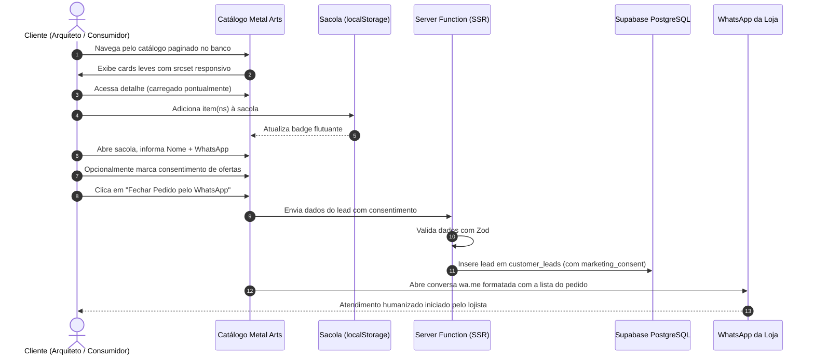

# Product Requirements Document (PRD) — Catálogo Metal Arts

> **Status:** Aprovado / Pronto para Produção  
> **Versão:** 2.1.0 (Performance, LGPD, Cookies, Auditoria & Identidade Fiscal)  
> **Autor:** Equipe de Engenharia e Produto  
> **Data de Atualização:** Setembro de 2026  
> **Segmento:** E-Commerce de Marcenaria Fina, Móveis Nobres e Design Sustentável

---

## 📌 1. Visão Geral do Produto e Objetivos de Negócio

### 1.1 Visão do Produto

O **Catálogo Metal Arts** é uma plataforma digital dedicada e exclusiva para a apresentação de móveis artesanais de alto padrão, marcenaria fina e projetos sob medida em madeira maciça nobre.

Diferente de e-commerces convencionais com checkouts burocráticos e intermediações de pagamento onerosas, a plataforma foi estruturada para criar um canal de venda de **alto valor percebido e zero atrito**, conectando o consumidor diretamente aos especialistas da Metal Arts via **WhatsApp**, com uma sacola estruturada e pré-orçamento detalhado.

### 1.2 Objetivos de Negócio

- **Elevar a Percepção de Valor da Marca:** Apresentar as peças com fotografias de altíssima fidelidade (suporte a 4K e imagens responsivas), detalhamento de espécies nobres de madeira, acabamentos manuais e storytelling da marcenaria artesanal.
- **Conversão Direta e Humanizada:** Transferir o cliente interessado para o WhatsApp com todos os itens, acabamentos e dados pré-preenchidos, agilizando o fechamento comercial.
- **Captura Estruturada de Leads com Conformidade LGPD:** Gravar contatos e preferências de produtos com opt-in explícito e voluntário de marketing, respeitando a privacidade dos clientes.
- **Autonomia Total do Lojista:** Painel administrativo intuitivo para controle de produtos, estoques, banners sazonais, textos institucionais, cores da marca e **CNPJ da empresa** sem depender de suporte técnico.
- **Transparência e Governança:** Rastreabilidade completa de ações administrativas sensíveis via trilhas de auditoria e canal oficial para direitos dos titulares de dados.

---

## 👤 2. Personas e Públicos-Alvo

### Persona 1: "Helena — A Arquiteta / Consumidora de Alto Padrão"

- **Perfil:** 36 anos, busca peças exclusivas para projetos residenciais ou sua própria casa. Valoriza madeira de procedência, sustentabilidade e acabamentos nobres.
- **Comportamento:** Acessa principalmente pelo celular através de publicações e stories do Instagram.
- **Necessidades:** Visualizar fotos detalhadas das texturas da madeira, consultar dimensões exatas, entender o tipo de acabamento (PU, óleo mineral) e ter facilidade para tirar dúvidas de personalização de medidas com o marceneiro.

### Persona 2: "Gestor Comercial / Marceneiro da Metal Arts"

- **Perfil:** Especialista em marcenaria e atendimento ao cliente.
- **Necessidades:** Receber pedidos já organizados no WhatsApp (com nomes de peças, quantidades e valores somados), cadastrar novas criações com facilidade no painel administrativo, gerenciar banners promocionais e manter dados fiscais da empresa (CNPJ) visíveis para passar segurança aos compradores.

---

## ⚙️ 3. Requisitos Funcionais (RF)

### 3.1 Módulo: Experiência do Consumidor (Público)

- **RF01 - Hero Carousel Responsivo com Suporte a Imagem Mobile:**
  - Carrossel rotativo no topo da página inicial com transições suaves e pausa no hover.
  - Tag `<picture>` com imagem vertical dedicada em smartphones (até 640px) e panorâmica em telas maiores.
  - Carregamento prioritário de rede (`fetchPriority="high"`, `loading="eager"`) no primeiro slide (LCP).

- **RF02 - Grid Promocional de 4 Cards:**
  - Grade de 4 mini-banners promocionais com selos visuais refinados para coleções em destaque.

- **RF03 - Vitrine Interativa de Madeiras Nobres:**
  - Seção interativa destacando espécies nobres utilizadas na marcenaria (Cumaru, Muiracatiara, Cedro Rosa, Peroba Rosa).

- **RF04 - Banner Central Panorâmico & Seção Editorial:**
  - Banner de grande impacto visual dedicado a projetos sob medida e manifesto de sustentabilidade da marcenaria artesanal.

- **RF05 - Catálogo Geral Paginado no Banco (`/catalogo`):**
  - Listagem de peças ativas com busca textual em tempo real por nome.
  - Filtro instantâneo por categorias de móveis.
  - Ordenação por: Novidades, Menor Preço e Maior Preço.
  - **Paginação real no PostgreSQL** via `range(from, to)` com sincronização na URL (`?pagina=X`), mantendo alta performance com dezenas/centenas de produtos.
  - Imagens servidas via `srcset` e `sizes` responsivos com memoização de cards.

- **RF06 - Página Detalhada da Peça (`/produto/$id`):**
  - Loader otimizado que carrega **exclusivamente o produto requisitado sob demanda**.
  - Galeria de imagens em alta definição com pré-carregamento instantâneo.
  - Ficha técnica completa de marcenaria: Espécie de Madeira, Dimensões, Acabamento, Peso aproximado (kg) e SKU.
  - Alerta de disponibilidade de estoque e unidades restantes (quando estoque ≤ 5).
  - Simulação de parcelamento em até 12x no cartão.
  - Carrossel de produtos relacionados da mesma categoria e compartilhamento via Web Share API.

- **RF07 - Lista de Favoritos (`/favoritos`):**
  - Adição e remoção de produtos aos favoritos com um clique, sem necessidade de login, persistidos no `localStorage`.

- **RF08 - Sacola de Compras & Fechamento no WhatsApp com Consentimento LGPD:**
  - Gaveta deslizante (Drawer) persistente em todas as páginas com contador de itens e subtotal.
  - Formulário com máscara de telefone brasileiro e validação de dados.
  - **Checkbox opcional de consentimento de marketing**, desmarcado por padrão (vedado opt-out forçado).
  - Gravação automática de lead no banco com sanitização Zod, timestamp e versão dos termos.
  - Geração de mensagem estruturada e abertura automática da conversa no WhatsApp oficial da loja.

- **RF09 - Gestão de Cookies e Banner de Privacidade (`CookieBanner`):**
  - Banner de consentimento não obstrutivo no rodapé na primeira visita.
  - Modal de preferências granulares com divisão entre cookies _Necessários_, _Analíticos_ e _Marketing_.
  - Ativação de scripts de telemetria e pixels estritamente condicionada ao aceite prévio do usuário.

- **RF10 - Canal de Atendimento ao Titular de Dados (`/direitos-titular`):**
  - Formulário oficial para solicitações de direitos previstos no Art. 18 da LGPD (acesso, correção, eliminação, revogação).
  - Emissão automática de número de protocolo de atendimento (`MA-YYYYMMDD-XXXX`).

- **RF11 - Páginas Institucionais de Privacidade e Cookies:**
  - Rotas públicas `/privacidade` e `/cookies` integradas ao rodapé e mapa do site (`sitemap.xml`).

---

### 3.2 Módulo: Painel Administrativo (`/admin`)

- **RF12 - Autenticação Segura:**
  - Acesso restrito a administradores autenticados via Supabase Auth (e-mail e senha) com validação de JWT no servidor.

- **RF13 - Dashboard de Indicadores:**
  - Cards em tempo real com Total de Produtos Ativos, Total de Banners e Volume de Leads capturados.

- **RF14 - Gestão Completa de Produtos (CRUD):**
  - Cadastro de nome, categoria, preço, preço promocional, descrição e status (ativo/destaque).
  - Campos técnicos especializados: Tipo de Madeira, Dimensões, Acabamento, Peso, Estoque e SKU.
  - Upload de foto de capa e galeria múltipla com compressão em WebP.

- **RF15 - Gestão de Categorias (CRUD):**
  - Criação, edição, exclusão e ordenação de categorias com imagem de capa.

- **RF16 - Gestão Multimodal de Banners:**
  - Controle independente de Hero (desktop/mobile), Grid (1..4), Banner Central e Banner Catálogo.

- **RF17 - Gestão de Leads, Auditoria e Exportação CSV Segura:**
  - Listagem com indicador visual de consentimento de marketing concedido ou não.
  - Exportação de contatos em formato CSV sanitizado contra fórmulas maliciosas, com registro automático de log `EXPORT_LEADS`.
  - Rotina para expurgo de contatos antigos em atendimento à política de retenção.

- **RF18 - Trilha de Auditoria Administrativa (`/admin/auditoria`):**
  - Histórico visual de todas as ações de administradores (login, alterações de configurações, mutações de catálogo e exportações).

- **RF19 - Identidade da Loja, Dados Fiscais e CNPJ:**
  - Ajuste do Nome da Loja, Logotipo, WhatsApp de vendas, Endereço e Redes Sociais.
  - **Campo "CNPJ da Empresa" (Opcional):** Permite ao lojista inserir o CNPJ da empresa, persistido no banco de dados e exibido automaticamente no rodapé do catálogo para conformidade com a Lei do E-commerce (Decreto 7.962/2013).
  - Seletor de Cor Primária com injeção instantânea via CSS Variables.
  - Edição de serviços, madeiras e diferenciais institucionais.

---

## 🔒 4. Requisitos Não-Funcionais (RNF)

- **RNF01 - Alta Performance & Escalabilidade de Catálogo:**
  - Catálogo rápido e responsivo mesmo com centenas de produtos ativos.
  - Paginação real no PostgreSQL via `range()` com seleção seletiva de colunas.
  - Card de produto memoizado com `React.memo`, `loading="lazy"`, `decoding="async"`, `srcset` responsivo e `priority` nos primeiros cards.
  - Carregamento pontual e sob demanda na visualização detalhada da peça (`/produto/$id`).

- **RNF02 - Compressão e Otimização de Mídia:**
  - Redimensionamento e conversão para WebP de alta fidelidade no cliente.
  - Transformações dinâmicas de largura e qualidade via Supabase Storage.
  - Cache imutável de 1 ano (`Cache-Control: 31536000, immutable`).

- **RNF03 - Segurança em Múltiplas Camadas & LGPD:**
  - RLS no PostgreSQL isolando escritas públicas.
  - Chave mestra `SUPABASE_SERVICE_ROLE_KEY` estritamente contida no servidor.
  - Middleware anti-CSRF e cabeçalhos estritos (CSP, HSTS, DENY, nosniff).
  - Sanitização de inputs com Zod e sanitização de CSV contra injeção de fórmulas.
  - Logs de auditoria forense para compliance legal.

- **RNF04 - Otimização para Buscadores (SEO) & Acessibilidade:**
  - Meta tags OpenGraph e Twitter Cards para compartilhamento enriquecido.
  - Arquivo `sitemap.xml` indexando páginas institucionais e de privacidade.
  - `robots.txt` com restrição aos painéis administrativos.

---

## 📊 5. Modelo de Dados e Índices

```sql
-- Principais tabelas no PostgreSQL
-- 1. store_settings: configurações gerais, marca, redes sociais, textos e CNPJ (opcional)
-- 2. categories: categorias de peças de madeira
-- 3. banners: banners hero (desktop/mobile), grid (1..4), central (5) e catálogo (6)
-- 4. products: produtos com atributos técnicos de marcenaria, estoque e galeria
-- 5. customer_leads: contatos com consentimento de marketing (LGPD)
-- 6. audit_logs: histórico forense de ações do lojista e administradores

-- Índices de performance
CREATE INDEX IF NOT EXISTS idx_products_active_sort_created ON public.products (sort_order ASC, created_at DESC) WHERE is_active = true;
CREATE INDEX IF NOT EXISTS idx_products_active_category_sort ON public.products (category_id, sort_order ASC, created_at DESC) WHERE is_active = true;
CREATE INDEX IF NOT EXISTS idx_products_name_lower ON public.products (lower(name));
CREATE INDEX IF NOT EXISTS idx_customer_leads_created ON public.customer_leads (created_at DESC);
CREATE INDEX IF NOT EXISTS idx_audit_logs_created_at ON public.audit_logs (created_at DESC);
```

---

## 🔄 6. Fluxo de Compra e Atendimento com Consentimento



---

## 🚀 7. Roadmap e Status de Execução

### Fase 1 — Fundação & E-commerce (Concluída ✅)

- [x] SSR com TanStack Start, React 19 e Vite 8.
- [x] Roteamento tipado com TanStack Router e cache TanStack Query v5.
- [x] Integração Supabase (PostgreSQL, Auth JWT, Storage com WebP).
- [x] Carrinho local e checkout estruturado via WhatsApp.

### Fase 2 — Especialização Marcenaria & Mídia (Concluída ✅)

- [x] Atributos técnicos de marcenaria (madeira nobre, acabamento, dimensões, peso, estoque).
- [x] Gestor multimodal de banners com imagem mobile dedicada (`<picture>`).
- [x] Vitrine interativa de madeiras nobres e seção editorial institucional.
- [x] Endurecimento de segurança (RLS, CSRF, Security Headers, Zod).

### Fase 3 — Performance, LGPD, Auditoria & Identidade Fiscal (Concluída ✅)

- [x] Paginação e contagem no PostgreSQL com `range(from, to)`.
- [x] Eliminação de gargalos com `ProductCard` memoizado e imagens responsivas com `srcset`.
- [x] Carregamento sob demanda do produto individual sem baixar catálogo completo.
- [x] Feature de Privacidade e Cookie Consent (`CookieBanner` + `CookiePreferencesModal`).
- [x] Opt-in opcional e desmarcado de marketing em pedidos.
- [x] Páginas oficiais de `/privacidade`, `/cookies` e canal do titular `/direitos-titular` com protocolo.
- [x] Tabela `audit_logs` e painel `/admin/auditoria`.
- [x] Exportação de contatos para CSV sanitizada e rotina de expurgo de retenção.
- [x] **Campo CNPJ da Empresa (Opcional)** na Identidade da Loja e exibição legal no rodapé.

### Fase 4 — Expansão Comercial (Próximos Passos 🔮)

- [ ] Distribuição de leads entre múltiplos atendentes no WhatsApp.
- [ ] Geração dinâmica de catálogo em PDF em alta resolução para arquitetos.
- [ ] Simulador de frete rodoviário para peças de grande porte.
