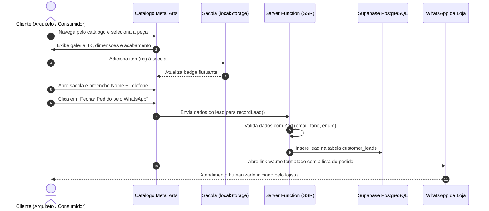

# Product Requirements Document (PRD) — Catálogo Metal Arts

> **Status:** Aprovado / Pronto para Produção  
> **Versão:** 2.0.0  
> **Autor:** Equipe de Engenharia e Produto  
> **Data de Atualização:** Setembro de 2026  
> **Segmento:** E-Commerce de Marcenaria Fina, Móveis Nobres e Design Sustentável

---

## 📌 1. Visão Geral do Produto e Objetivos de Negócio

### 1.1 Visão do Produto
O **Catálogo Metal Arts** é uma plataforma digital dedicada e exclusiva para a apresentação de móveis artesanais de alto padrão, marcenaria fina e projetos sob medida em madeira maciça nobre.

Diferente de e-commerces convencionais com checkouts burocráticos e intermediações de pagamento onerosas, a plataforma foi estruturada para criar um canal de venda de **alto valor percebido e zero atrito**, conectando o consumidor diretamente aos especialistas da Metal Arts via **WhatsApp**, com uma sacola estruturada e pré-orçamento detalhado.

### 1.2 Objetivos de Negócio
- **Elevar a Percepção de Valor da Marca:** Apresentar as peças com fotografias de altíssima fidelidade (suporte a 4K), detalhamento de espécies nobres de madeira, acabamentos manuais e storytelling da marcenaria artesanal.
- **Conversão Direta e Humanizada:** Transferir o cliente interessado para o WhatsApp com todos os itens, acabamentos e dados pré-preenchidos, agilizando o fechamento comercial.
- **Captura Estruturada de Leads:** Gravar contatos e preferências de produtos no banco de dados para formação de base de clientes (CRM) e ações de remarketing.
- **Autonomia Total do Lojista:** Painel administrativo descomplicado e intuitivo, permitindo ao gestor da Metal Arts controlar produtos, estoques, banners sazonais, textos institucionais e cores da marca sem depender de suporte técnico.

---

## 👤 2. Personas e Públicos-Alvo

### Persona 1: "Helena — A Arquiteta / Consumidora de Alto Padrão"
- **Perfil:** 36 anos, busca peças exclusivas para projetos residenciais ou sua própria casa. Valoriza madeira de procedência, sustentabilidade e acabamentos nobres.
- **Comportamento:** Acessa principalmente pelo celular através de publicações e stories do Instagram.
- **Necessidades:** Visualizar fotos detalhadas das texturas da madeira, consultar dimensões exatas, entender o tipo de acabamento (PU, óleo mineral) e ter facilidade para tirar dúvidas de personalização de medidas com o marceneiro.

### Persona 2: "Gestor Comercial / Marceneiro da Metal Arts"
- **Perfil:** Especialista em marcenaria e atendimento ao cliente.
- **Necessidades:** Receber pedidos já organizados no WhatsApp (com nomes de peças, quantidades e valores somados), cadastrar novas criações com facilidade no painel administrativo e gerenciar banners promocionais para campanhas sazonais.

---

## ⚙️ 3. Requisitos Funcionais (RF)

### 3.1 Módulo: Experiência do Consumidor (Público)

- **RF01 - Hero Carousel Responsivo com Suporte a Imagem Mobile:**
  - Carrossel rotativo no topo da página inicial com transições suaves e pausa ao passar o mouse.
  - Suporte nativo à tag `<picture>` para entrega de imagem vertical dedicada em smartphones (até 640px) e imagem panorâmica em telas maiores.
  - Carregamento prioritário de rede (`fetchPriority="high"`, `loading="eager"`) no primeiro slide para garantir ótimo índice LCP.

- **RF02 - Grid Promocional de 4 Cards:**
  - Grade de 4 mini-banners promocionais com selos refinados ("Mais Procurado", "Pronta Entrega", "Madeira Maciça") para coleções de destaque.

- **RF03 - Vitrine Interativa de Madeiras Nobres:**
  - Seção interativa destacando espécies nobres utilizadas na marcenaria (Cumaru, Muiracatiara, Cedro Rosa, Peroba Rosa), com características de durabilidade, veios e tonalidades.

- **RF04 - Banner Central Panorâmico & Seção Editorial:**
  - Banner de grande impacto visual dedicado a projetos sob medida.
  - Seção editorial ("A Arte da Marcenaria Fina") com diferenciais da marcenaria artesanal, processos manuais e manifesto de sustentabilidade.

- **RF05 - Catálogo Completo com Filtros e Busca (`/catalogo`):**
  - Listagem de peças ativas com busca textual em tempo real por nome e descrição.
  - Filtro instantâneo por categorias de móveis.
  - Ordenação por: Novidades, Menor Preço e Maior Preço.
  - Paginação rápida e reativa sincronizada no parâmetro `?pagina=X` da URL.
  - Banner de promoção geral configurável no topo do catálogo.

- **RF06 - Página Detalhada da Peça (`/produto/$id`):**
  - Galeria de imagens em alta definição com pré-carregamento instantâneo ao passar o mouse sobre as miniaturas.
  - Ficha técnica completa de marcenaria: Espécie de Madeira, Dimensões (AxLxP), Tipo de Acabamento, Peso aproximado (kg) e SKU.
  - Alerta de disponibilidade de estoque e aviso de últimas unidades (quando estoque ≤ 5).
  - Simulação dinâmica de parcelamento em até 12x no cartão.
  - Carrossel de produtos relacionados da mesma categoria.
  - Compartilhamento nativo via Web Share API.

- **RF07 - Lista de Favoritos (`/favoritos`):**
  - Adição e remoção de produtos aos favoritos com um clique, sem necessidade de login, persistidos no `localStorage`.

- **RF08 - Sacola de Compras & Fechamento no WhatsApp:**
  - Gaveta deslizante (Drawer) persistente em todas as páginas com contador de itens.
  - Controle de quantidade e cálculo automático do subtotal.
  - Formulário com máscara de telefone brasileiro e validação de dados.
  - Gravação automática de lead no banco com sanitização Zod.
  - Geração de mensagem estruturada e abertura automática da conversa com o WhatsApp oficial da loja.

---

### 3.2 Módulo: Painel Administrativo (`/admin`)

- **RF09 - Autenticação Segura:**
  - Acesso restrito a administradores autenticados via Supabase Auth (e-mail e senha).
  - Middleware de proteção de rotas com validação de token JWT no servidor.

- **RF10 - Dashboard de Indicadores:**
  - Exibição de cards em tempo real com: Total de Produtos Ativos, Total de Banners e Volume de Leads capturados no mês.

- **RF11 - Gestão Completa de Produtos (CRUD):**
  - Cadastro de nome, categoria, preço, preço promocional, descrição e status (ativo/destaque).
  - Campos técnicos especializados: Tipo de Madeira, Dimensões, Acabamento, Peso, Estoque e SKU.
  - Upload de foto principal e galeria com compressão automática em WebP de alta definição.

- **RF12 - Gestão de Categorias (CRUD):**
  - Criação, edição, exclusão e ordenação de categorias com imagem de capa.

- **RF13 - Gestão Multimodal de Banners:**
  - Controle independente de 4 formatos de mídia:
    1. **Hero:** Slides principais com campo para imagem Desktop e imagem Mobile;
    2. **Grid:** 4 posições fixas com mini-cards promocionais;
    3. **Banner Central:** Destaque institucional de grande impacto;
    4. **Banner Catálogo:** Imagem do topo da página `/catalogo`.

- **RF14 - Gestão e Exportação de Leads:**
  - Tabela com histórico de contatos gerados via pedidos e newsletter.
  - Botão para exportação completa em formato **CSV**.

- **RF15 - Personalização da Marca (White-Label):**
  - Ajuste de Nome da Loja, Logotipo, WhatsApp de atendimento, Endereço e Redes Sociais.
  - Seletor de Cor Primária com aplicação instantânea em todo o site via CSS Variables.
  - Limite de parcelamento e edição dos textos da seção institucional.

---

## 🔒 4. Requisitos Não-Funcionais (RNF)

- **RNF01 - Performance e Core Web Vitals:**
  - Primeira renderização de página pública via SSR em menos de 1,2s.
  - CLS (Cumulative Layout Shift) zero através de containers com proporção fixa (`aspect-square`, `aspect-[16/7]`).
  - LCP otimizado com `fetchPriority="high"` na primeira imagem da home e do produto.

- **RNF02 - Compressão Inteligente de Mídia:**
  - Redimensionamento de fotos até resolução 4K (3840px) e conversão para WebP no cliente com qualidade 0.92.
  - Cache imutável de 1 ano (`Cache-Control: 31536000, immutable`) no Supabase Storage.

- **RNF03 - Segurança em Múltiplas Camadas:**
  - Políticas de RLS rigorosas no PostgreSQL: o cliente público não possui permissões diretas de escrita no banco.
  - Todas as mutações do painel são realizadas por Server Functions protegidas com a `SUPABASE_SERVICE_ROLE_KEY` e middleware anti-CSRF.
  - Cabeçalhos de segurança estritos aplicados no servidor (CSP, HSTS, X-Frame-Options: DENY).

- **RNF04 - Otimização para Mecanismos de Busca (SEO):**
  - Metadados dinâmicos OpenGraph e Twitter Cards para compartilhamento enriquecido no WhatsApp e redes sociais.
  - Arquivo `robots.txt` estruturado com bloqueio de indexação para `/admin` e `/auth`.

---

## 📊 5. Modelo de Dados e Índices de Performance

```sql
-- Principais tabelas no PostgreSQL
-- 1. store_settings: configurações gerais, marca, redes sociais e textos institucionais
-- 2. categories: categorias de peças de madeira
-- 3. banners: banners hero (desktop/mobile), grid (1..4), central (5) e catálogo (6)
-- 4. products: produtos com atributos técnicos de marcenaria, estoque e galeria
-- 5. customer_leads: registro de intenções de compra e newsletter

-- Índices parciais de aceleração de consultas
CREATE INDEX IF NOT EXISTS idx_products_active ON public.products(is_active) WHERE is_active = true;
CREATE INDEX IF NOT EXISTS idx_products_featured ON public.products(is_featured) WHERE is_featured = true;
CREATE INDEX IF NOT EXISTS idx_banners_active_sort ON public.banners(is_active, sort_order) WHERE is_active = true;
CREATE INDEX IF NOT EXISTS idx_categories_sort ON public.categories(sort_order);
```

---

## 🔄 6. Fluxo de Compra e Atendimento



---

## 🚀 7. Roadmap e Evoluções

### Fase 1 — Fundação & E-commerce (Concluída ✅)
- [x] SSR com TanStack Start, React 19 e Vite 8.
- [x] Roteamento tipado com TanStack Router e cache TanStack Query v5.
- [x] Integração Supabase (PostgreSQL, Auth JWT, Storage com WebP).
- [x] Carrinho local e checkout estruturado via WhatsApp.
- [x] Galeria múltipla de imagens por produto.

### Fase 2 — Especialização Marcenaria & Otimização Produção (Concluída ✅)
- [x] Atributos técnicos de marcenaria (madeira nobre, acabamento, dimensões, peso, estoque).
- [x] Gestor multimodal de banners com imagem mobile dedicada (`<picture>`).
- [x] Vitrine interativa de madeiras nobres e seção editorial institucional.
- [x] Endurecimento de segurança (RLS, CSRF, Security Headers, Zod).
- [x] Índices de performance de banco e cache de mídia de 1 ano.
- [x] Otimização profunda de performance (remoção de dead code, componentes órfãos e estabilização de hidratação SSR).
- [x] Melhorias de UX/UI responsiva no painel de administração e vitrine móvel (banner central adaptativo).

### Fase 3 — Expansão Comercial (Futuro 🔮)
- [ ] Módulo de múltiplos atendentes de WhatsApp (distribuição automática de leads entre vendedores).
- [ ] Geração automática de catálogo em PDF em alta resolução para arquitetos.
- [ ] Integração com cálculo estimado de frete rodoviário para móveis de grande porte.
